# Ai-WanAndroid

一个基于Jetpack Compose和现代Android架构开发的WanAndroid客户端应用，采用MVVM架构模式，提供完整的Android技术知识平台功能。


---

## 目录

- [项目简介](#项目简介)
- [技术栈](#技术栈)
- [项目架构](#项目架构)
- [功能模块详解](#功能模块详解)
- [界面预览](#界面预览)
- [开发环境配置](#开发环境配置)
- [项目结构](#项目结构)
- [快速开始](#快速开始)
- [API文档](#api文档)
- [贡献指南](#贡献指南)
- [许可证](#许可证)
- [更新日志](#更新日志)

---

## 项目简介

Ai-WanAndroid是一个通过AI编程工具TRAE生成的现代化Android应用，基于[WanAndroid开放API](https://www.wanandroid.com/blog/show/2)构建。项目采用最新的Android开发技术栈，包括Jetpack Compose、Hilt依赖注入、Kotlin协程等，实现了完整的用户认证、文章浏览、收藏管理、搜索等功能。

### AI开发环境

本项目使用**字节跳动TRAE AI IDE**作为主要开发工具，充分利用AI能力加速开发流程：

| 组件 | 说明 |
|------|------|
| **TRAE AI IDE** | 字节跳动推出的AI集成开发环境，提供智能代码补全、代码生成、重构建议等功能 |
| **GLM-7** | 大语言模型，用于代码理解、架构设计和复杂逻辑实现 |
| **Kimi-K2.5** | 大语言模型，用于代码审查、文档生成和最佳实践建议 |

### AI Skills模块

项目开发过程中应用了以下AI Skills模块，提升代码质量和开发效率：

| Skill模块 | 用途 |
|-----------|------|
| **compose-expert** | Jetpack Compose专家级指导，包括状态管理、重组优化、自定义组件开发 |
| **kotlin-expert** | Kotlin语言专家支持，涵盖协程、Flow、DSL构建器等高级特性 |
| **mobile-android-design** | Material Design 3设计规范指导，UI/UX最佳实践 |
| **frontend-design** | 前端设计理念融入，提升界面美观度和用户体验 |

### 核心特性

- **现代化UI**: 使用Jetpack Compose构建声明式UI，支持Material Design 3设计规范
- **响应式设计**: 自适应不同屏幕尺寸，提供一致的用户体验
- **完整功能**: 涵盖文章浏览、搜索、收藏、积分、待办等完整功能链
- **性能优化**: 多级缓存策略、骨架屏加载、图片懒加载
- **国际化支持**: 支持简体中文、英文、日文多语言切换
- **AI辅助开发**: 全程使用TRAE AI IDE和先进大模型技术栈构建

---

## 技术栈

### 核心框架

| 技术 | 版本 | 说明 |
|------|------|------|
| **Kotlin** | 2.0.0 | 主要编程语言 |
| **Android Gradle Plugin** | 8.7.2 | 构建工具 |
| **Jetpack Compose** | 2024.04.01 | 声明式UI框架 |
| **Hilt** | 2.49 | 依赖注入框架 |
| **Kotlin Coroutines** | 1.7.3 | 异步编程 |

### 网络请求

| 技术 | 版本 | 说明 |
|------|------|------|
| **Retrofit** | 2.9.0 | RESTful API客户端 |
| **OkHttp** | 4.12.0 | HTTP客户端 |
| **Gson** | 2.10.1 | JSON解析 |

### UI组件

| 技术 | 版本 | 说明 |
|------|------|------|
| **Material Design 3** | - | Material3设计规范 |
| **Coil** | 2.7.0 | 图片加载库 |
| **Accompanist** | 0.32.0 | 下拉刷新、权限处理 |

### 数据存储

| 技术 | 版本 | 说明 |
|------|------|------|
| **DataStore** | 1.0.0 | 类型安全偏好设置 |
| **Room** | 2.6.1 | SQLite数据库抽象层 |
| **SharedPreferences** | - | 轻量级键值存储 |

### 导航与状态管理

| 技术 | 版本 | 说明 |
|------|------|------|
| **Navigation Compose** | 2.7.7 | 页面导航 |
| **Hilt Navigation Compose** | 1.2.0 | 导航依赖注入 |

---

## 项目架构

### 整体架构设计

项目采用**MVVM (Model-View-ViewModel)**架构模式，结合**Clean Architecture**思想，实现清晰的分层架构：

```
┌─────────────────────────────────────────┐
│           UI Layer (Compose)            │
│  - Pages (HomePage, MinePage, etc.)     │
│  - Components (ArticleItem, etc.)       │
│  - ViewModels                           │
└──────────────┬──────────────────────────┘
               │
┌──────────────▼──────────────────────────┐
│        Repository Layer                 │
│  - NetworkRepository                    │
│  - DataCacheManager                     │
│  - UserManager                          │
└──────────────┬──────────────────────────┘
               │
┌──────────────▼──────────────────────────┐
│        Network Layer                    │
│  - ApiService                           │
│  - GlobalErrorInterceptor               │
│  - ErrorHandler                         │
└─────────────────────────────────────────┘
```

### 架构组件关系

```
用户交互 → UI组件 → ViewModel → Repository → Network → API
    ↓           ↓          ↓          ↓
  State更新   UI刷新    缓存更新   数据存储
```

### 模块划分

#### 1. UI层 (ui)

**pages**: 页面组件，包含16个功能页面
- `HomePage`: 首页（Banner轮播 + 文章列表 + 热门卡片）
- `SquarePage`: 广场页面（公众号 + 文章列表）
- `ProjectPage`: 项目页面（分类Tab + 项目列表）
- `NavigationPage`: 导航页面（左右分栏导航）
- `MinePage`: 我的页面（用户信息 + 功能入口）
- `LoginPage/RegisterPage`: 登录/注册页面
- `SearchPage`: 搜索页面（热词 + 历史记录）
- `CollectPage`: 收藏页面（收藏列表管理）
- `TodoPage`: 待办页面（待办事项管理）
- `CoinPage`: 积分页面（积分明细 + 排行榜）
- `MessagePage`: 消息页面（已读/未读消息）
- `SettingsPage`: 设置页面（主题 + 语言 + 退出登录）
- `ArticleDetailPage`: 文章详情（WebView展示）
- `WendaListPage/WendaDetailPage`: 问答列表/详情

**components**: 可复用UI组件
- `ArticleItem`: 文章列表项，支持置顶/新文章标签
- `BannerCarousel`: Banner轮播图，自动轮播+指示器
- `BottomNavigationBar`: 底部导航栏，5个主Tab
- `AppTopAppBar`: 顶部应用栏，支持返回/标题/操作
- `Skeleton`: 骨架屏组件，加载占位效果
- `CollectIcon`: 收藏图标按钮，带动画效果
- `SearchBox`: 搜索输入框组件
- `PopularCards`: 热门卡片区域

**viewmodel**: 视图模型
- 每个页面对应一个ViewModel
- 使用StateFlow管理UI状态
- 支持加载状态、错误状态、空状态处理

**state**: UI状态管理
- 每个页面对应一个UiState数据类
- 使用不可变数据结构

**theme**: 主题配置
- `Color`: 完整的Material 3色彩体系
- `Type`: 字体排版规范
- `Shape`: 形状定义
- `Spacing`: 间距系统（4dp网格）
- `Theme`: 主题配置（支持浅色/深色/动态色彩）

#### 2. 网络层 (network)

**api**: API接口定义
- `ApiService`: 完整的WanAndroid API接口（30+个接口）

**model**: 数据模型
- `ApiResponse`: 统一API响应基类
- `Article`, `Banner`, `UserInfo`等数据模型

**repository**: 数据仓库
- `NetworkRepository`: 统一封装API调用
- 返回`Result<T>`类型，便于错误处理

**interceptor**: 拦截器
- `GlobalErrorInterceptor`: 全局错误拦截
- Cookie管理拦截器

**exception**: 异常处理
- 自定义异常类（ApiException, NotLoginException等）
- `ErrorHandler`: 统一错误处理
- `ErrorCode`: 错误码定义

#### 3. 数据层 (data)

- `UserManager`: 用户信息管理（SharedPreferences）
- `SettingsDataStore`: 应用设置存储（DataStore）
- `SearchHistoryDao`: 搜索历史数据库访问（Room）

#### 4. 缓存层 (cache)

- `DataCacheManager`: 内存缓存管理器
- 支持可配置的缓存过期时间
- 使用ConcurrentHashMap实现线程安全

#### 5. 导航层 (navigation)

- `AppNavigation`: 应用导航配置
- `NavigationRoutes`: 路由常量定义
- `NavigationArguments`: 导航参数定义

#### 6. 工具层 (utils)

- `AppContext`: 应用上下文
- `LogUtils`: 日志工具
- `ToastUtils`: Toast工具

---

## 功能模块详解

### 1. 用户认证模块

**功能目的**: 提供用户身份验证功能，保护用户数据安全

**使用场景**: 
- 首次使用应用需要登录
- 访问收藏、积分等个人功能
- Token过期后重新登录

**操作流程**:
1. 打开应用，未登录状态下自动跳转登录页
2. 输入用户名和密码
3. 点击登录按钮，验证成功后保存Cookie
4. 自动跳转首页

**技术实现**:
- 使用SharedPreferences存储用户信息
- Cookie自动管理（OkHttp CookieJar）
- 登录状态全局监听

### 2. 首页模块

**功能目的**: 展示最新Android技术文章和推荐内容

**使用场景**:
- 每日浏览最新技术文章
- 查看置顶重要文章
- 快速访问热门功能（问答、专栏、路线）

**操作流程**:
1. 打开应用默认进入首页
2. 顶部Banner自动轮播展示推荐内容
3. 置顶文章列表展示重要文章
4. 普通文章列表支持下拉刷新和上拉加载
5. 点击热门卡片快速跳转对应功能

**技术实现**:
- Banner使用HorizontalPager实现自动轮播
- 文章列表使用LazyColumn实现虚拟列表
- 支持下拉刷新（Accompanist SwipeRefresh）
- 骨架屏加载效果提升感知性能

### 3. 广场模块

**功能目的**: 展示用户分享的公众号文章和技术文章

**使用场景**:
- 浏览优质公众号文章
- 发现社区分享的技术内容
- 快速进入搜索功能

**操作流程**:
1. 点击底部导航"广场"进入
2. 顶部搜索框可快速跳转搜索
3. 文章列表展示广场文章
4. 支持下拉刷新和分页加载

### 4. 项目模块

**功能目的**: 按分类展示开源项目和学习资源

**使用场景**:
- 查找特定类型的开源项目
- 学习优秀的项目实践
- 按技术栈筛选项目

**操作流程**:
1. 点击底部导航"项目"进入
2. 顶部Tab栏切换不同项目分类
3. 项目列表展示分类下的项目文章
4. 点击项目卡片查看详情

**技术实现**:
- 使用ScrollableTabRow实现可滚动分类Tab
- 支持左右滑动切换分类
- 每个分类独立维护分页状态

### 5. 导航模块

**功能目的**: 提供网站导航和技术资源链接

**使用场景**:
- 快速访问常用技术网站
- 发现新的技术资源
- 按分类浏览导航链接

**操作流程**:
1. 点击底部导航"导航"进入
2. 左侧分类列表选择导航分类
3. 右侧展示该分类下的导航链接
4. 点击链接使用WebView打开

**技术实现**:
- 左右分栏布局（Row + weight）
- 左侧分类使用LazyColumn
- 右侧使用FlowLayout展示标签
- 每个导航项生成随机颜色标签

### 6. 我的模块

**功能目的**: 用户个人中心，展示用户信息和功能入口

**使用场景**:
- 查看个人积分和等级
- 进入收藏、待办、消息等功能
- 访问设置页面

**操作流程**:
1. 点击底部导航"我的"进入
2. 顶部显示用户头像和昵称
3. 积分卡片展示当前积分
4. 功能列表提供收藏、待办、消息入口
5. 设置入口可切换主题和语言

**技术实现**:
- 使用Card组件展示用户信息
- 积分数据实时获取
- 未登录状态显示默认头像和登录按钮

### 7. 收藏模块

**功能目的**: 管理用户收藏的技术文章

**使用场景**:
- 收藏有价值的文章供以后阅读
- 管理已收藏的文章列表
- 添加站外文章到收藏

**操作流程**:
1. 从"我的"页面点击"我的收藏"进入
2. 收藏列表展示已收藏文章
3. 左滑可取消收藏
4. 点击"+"按钮添加站外收藏
5. 长按可编辑收藏信息

**技术实现**:
- 使用LazyColumn展示收藏列表
- 支持滑动删除（SwipeToDismiss）
- 收藏状态全局同步

### 8. 搜索模块

**功能目的**: 搜索全站技术文章

**使用场景**:
- 查找特定技术主题的文章
- 浏览热门搜索词
- 查看搜索历史

**操作流程**:
1. 点击首页或广场搜索框进入
2. 输入关键词搜索
3. 或点击热门搜索词快速搜索
4. 搜索结果分页展示
5. 搜索历史自动保存

**技术实现**:
- 使用Room数据库存储搜索历史
- 热门搜索词从API获取
- 搜索结果支持下拉刷新和分页

### 9. 待办模块

**功能目的**: 管理个人待办事项

**使用场景**:
- 记录学习计划
- 管理技术待办事项
- 跟踪任务完成状态

**操作流程**:
1. 从"我的"页面点击"待办清单"进入
2. 待办列表展示所有待办
3. 点击复选框标记完成/未完成
4. 点击"+"添加新待办
5. 支持筛选和排序

**技术实现**:
- 使用ViewModel管理待办状态
- 支持按状态筛选（全部/未完成/已完成）
- 支持按日期排序

### 10. 积分模块

**功能目的**: 展示用户积分明细和排行榜

**使用场景**:
- 查看积分获取记录
- 了解积分排名
- 激励用户活跃参与

**操作流程**:
1. 从"我的"页面点击积分卡片进入
2. 积分明细Tab展示积分记录
3. 排行榜Tab展示积分排名
4. 支持下拉刷新获取最新数据

### 11. 消息模块

**功能目的**: 展示系统消息和互动通知

**使用场景**:
- 查看未读消息
- 浏览历史消息记录
- 了解文章互动情况

**操作流程**:
1. 从"我的"页面点击"消息"进入
2. 未读消息Tab展示新消息
3. 已读消息Tab展示历史消息
4. 点击消息查看详情

### 12. 问答模块

**功能目的**: 展示技术问答内容

**使用场景**:
- 浏览热门技术问答
- 学习解决问题的方法
- 参与问答互动

**操作流程**:
1. 从首页热门卡片点击"问答"进入
2. 问答列表展示热门问题
3. 点击问题进入详情页
4. 详情页展示问题和评论

### 13. 设置模块

**功能目的**: 应用个性化设置

**使用场景**:
- 切换浅色/深色主题
- 切换应用语言
- 退出登录

**操作流程**:
1. 从"我的"页面点击"设置"进入
2. 点击"主题设置"切换主题模式
3. 点击"语言设置"切换语言
4. 点击"退出登录"清除用户数据

**技术实现**:
- 使用DataStore存储设置
- 主题切换实时生效
- 语言切换使用LanguageWrapper包装

---

## 界面预览

### 登录与注册

| 登录页面 | 注册页面 |
|:--------:|:--------:|
| 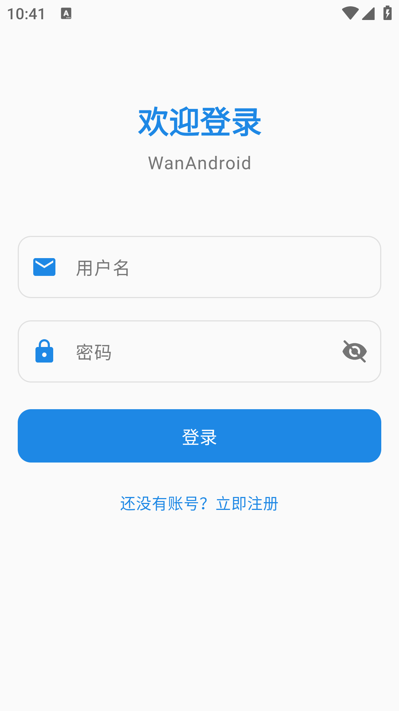 | 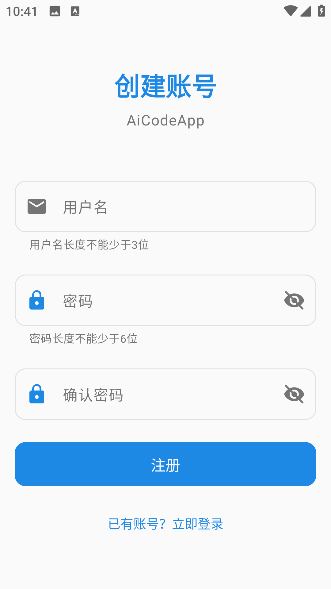 |
| 用户登录表单，支持用户名/密码输入，密码可见性切换 | 用户注册页面，包含用户名、密码、确认密码验证 |

**图1-2: 用户认证界面**

登录页面提供简洁的登录表单，包含用户名和密码输入框。密码输入框支持可见性切换，方便用户确认输入。注册页面提供完整的注册流程，包含密码确认验证，确保用户输入正确的密码。

### 首页

| 首页 | 首页滚动 |
|:----:|:--------:|
| 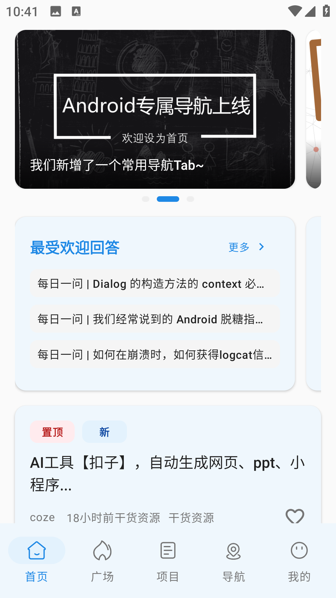 | 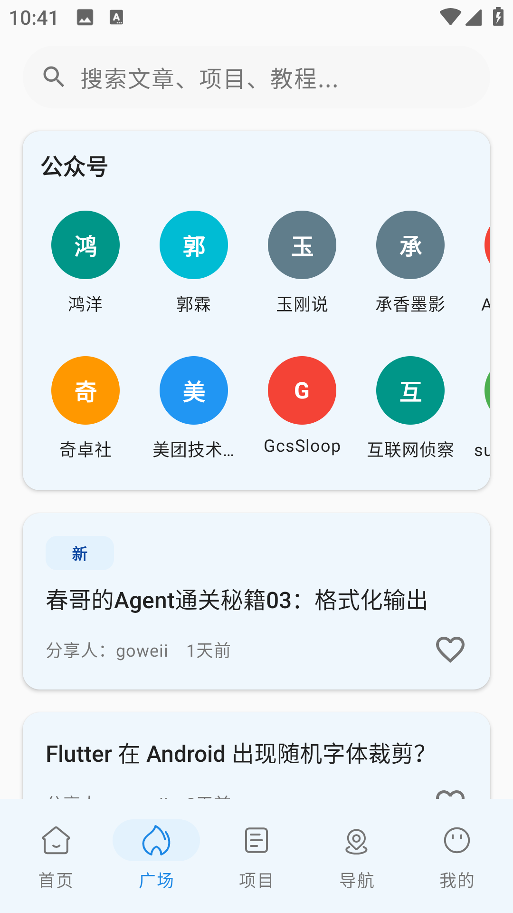 |
| 展示Banner轮播、置顶文章、热门卡片 | 文章列表支持上拉加载更多 |

**图3-4: 首页界面**

首页是应用的核心页面，顶部Banner轮播展示推荐内容，自动轮播并支持手动滑动。置顶文章区域展示重要文章，带有"置顶"标签标识。热门卡片区域提供问答、专栏、路线等功能的快速入口。文章列表支持下拉刷新和上拉加载更多，使用骨架屏提升加载体验。

### 广场与项目

| 广场页面 | 项目页面 |
|:--------:|:--------:|
| 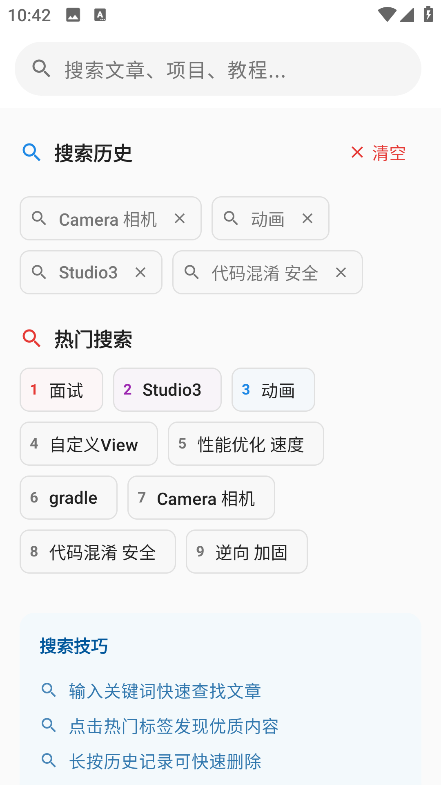 | 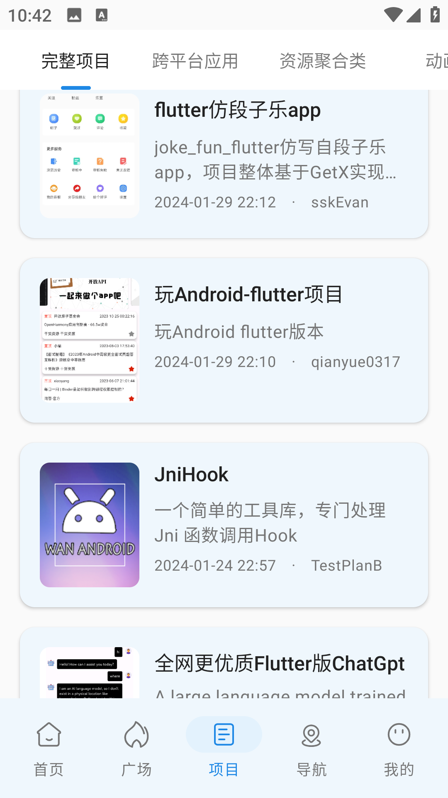 |
| 展示广场文章列表、搜索入口 | 项目分类展示，支持Tab切换不同分类 |

**图5-6: 广场与项目界面**

广场页面展示用户分享的技术文章，顶部提供搜索框快速跳转搜索功能。项目页面采用Tab分类设计，支持左右滑动切换不同项目分类，每个分类独立维护分页状态，方便用户浏览不同类型的开源项目。

### 导航与我的

| 导航页面 | 我的页面 |
|:--------:|:--------:|
| 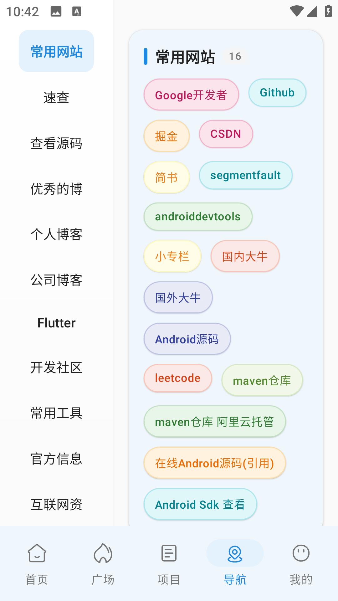 | 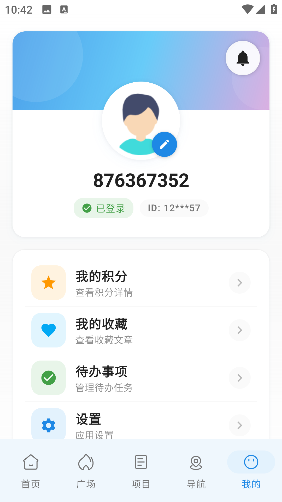 |
| 左右分栏导航，左侧分类，右侧标签式文章列表 | 用户中心，展示头像、积分、收藏、待办、设置入口 |

**图7-8: 导航与我的界面**

导航页面采用左右分栏设计，左侧展示导航分类，右侧使用流式布局展示该分类下的导航链接，每个链接带有随机颜色标签便于识别。我的页面是用户个人中心，展示用户头像、昵称、积分信息，提供收藏、待办、消息、设置等功能入口。

### 收藏与搜索

| 收藏页面 | 搜索页面 |
|:--------:|:--------:|
| 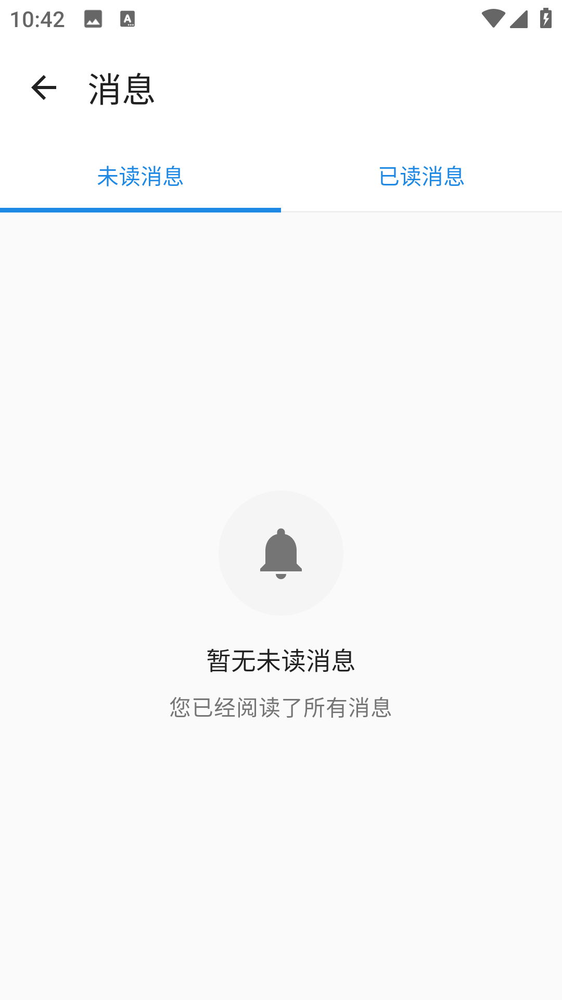 | 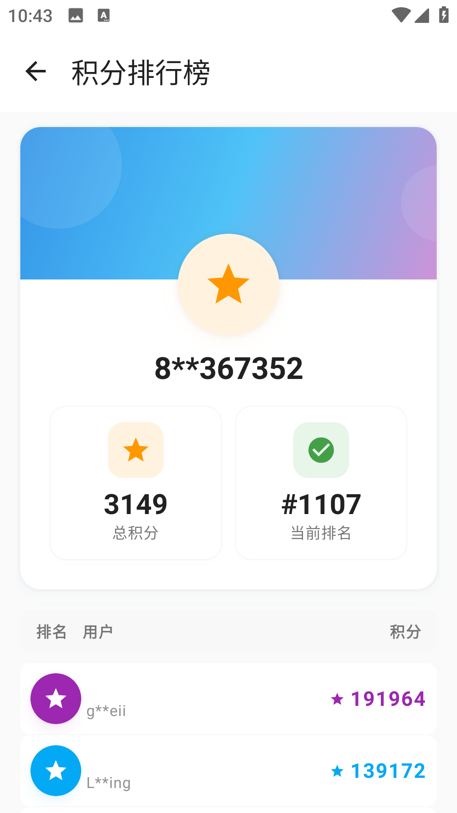 |
| 用户收藏文章管理，支持添加、编辑、删除 | 文章搜索，支持历史记录、热门搜索词 |

**图9-10: 收藏与搜索界面**

收藏页面展示用户收藏的文章列表，支持左滑取消收藏，点击"+"按钮可添加站外文章到收藏。搜索页面提供文章搜索功能，顶部搜索框支持关键词输入，下方展示搜索历史和热门搜索词，帮助用户快速找到感兴趣的内容。

### 待办与积分

| 待办页面 | 积分页面 |
|:--------:|:--------:|
| 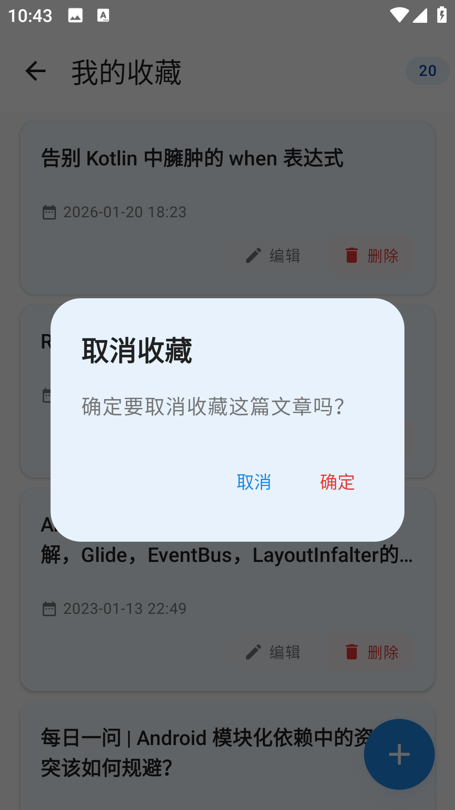 | 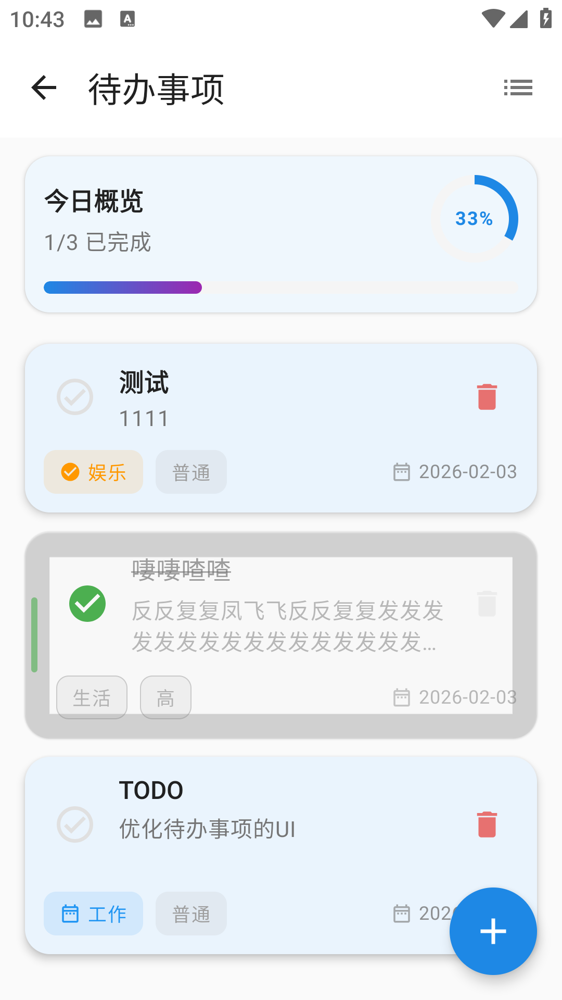 |
| 待办事项管理，支持筛选、排序、完成状态切换 | 用户积分展示、积分排行榜 |

**图11-12: 待办与积分界面**

待办页面帮助用户管理个人待办事项，支持按状态筛选（全部/未完成/已完成），点击复选框可快速标记完成状态。积分页面展示用户积分明细和排行榜，激励用户活跃参与社区互动。

### 消息与设置

| 消息页面 | 设置页面 |
|:--------:|:--------:|
| 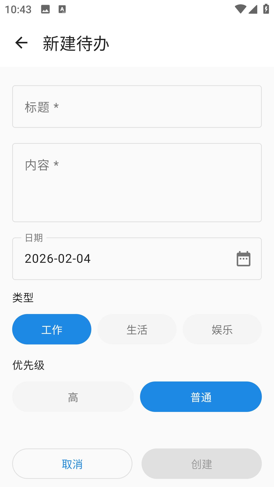 | 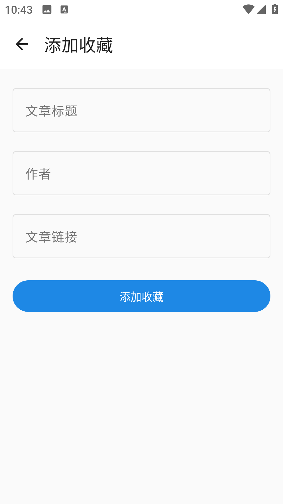 |
| 已读/未读消息列表，Tab切换 | 主题切换、语言切换、退出登录 |

**图13-14: 消息与设置界面**

消息页面使用Tab切换已读和未读消息，方便用户管理消息通知。设置页面提供应用个性化设置，包括主题设置（浅色/深色/跟随系统）、语言设置（简体中文/英文/日文）和退出登录功能。

### 文章详情与问答

| 文章详情 | 问答列表 |
|:--------:|:--------:|
| 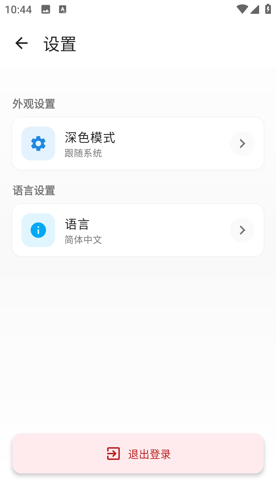 | 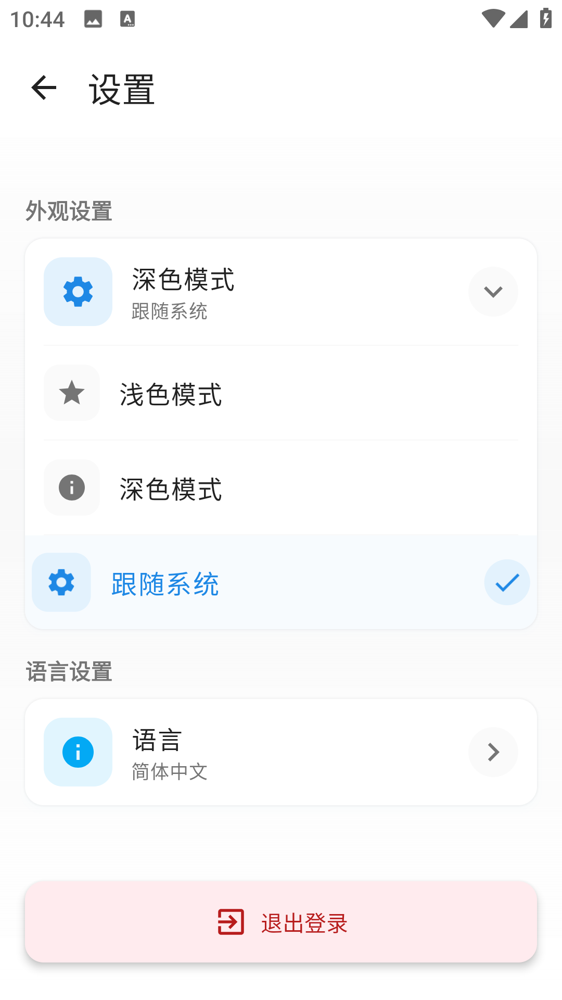 |
| WebView加载文章内容，支持收藏操作 | 热门问答列表展示 |

**图15-16: 文章详情与问答界面**

文章详情页面使用WebView加载文章内容，顶部显示文章标题，支持收藏操作。问答列表页面展示热门技术问答，用户可以浏览问题和回答，学习解决问题的方法。

### 更多功能

| 添加收藏 | 主题设置 | 语言设置 |
|:--------:|:--------:|:--------:|
| 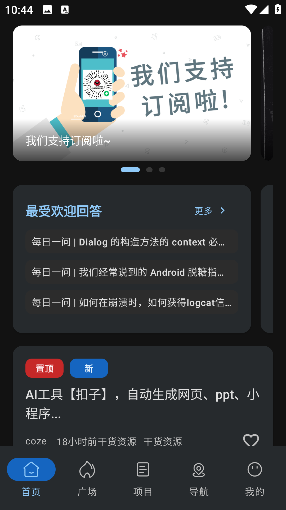 | 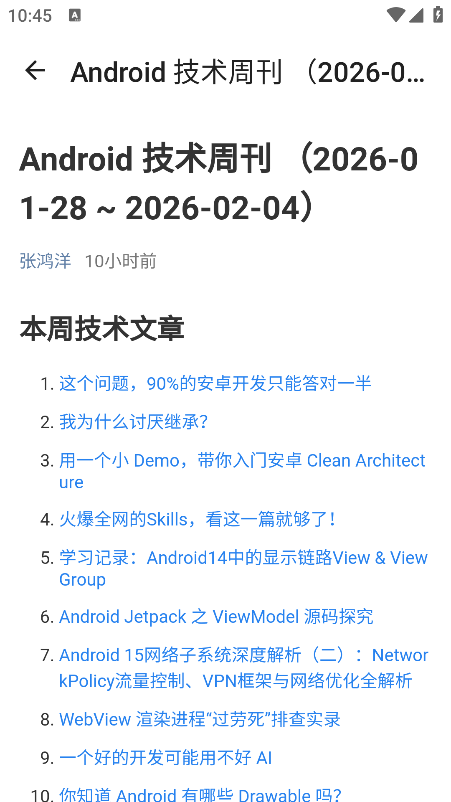 | 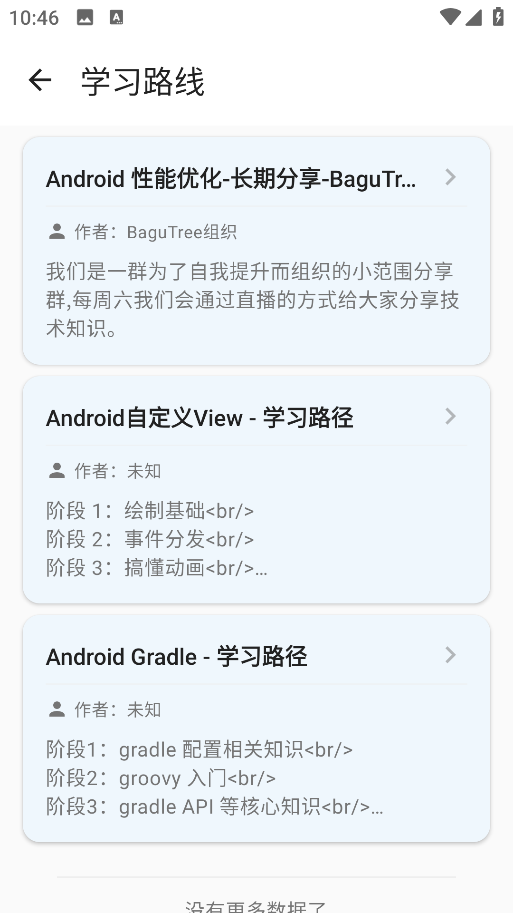 |
| 添加站外文章到收藏 | 切换浅色/深色/跟随系统主题 | 切换简体中文/英文/日文 |

**图17-19: 更多功能界面**

添加收藏页面允许用户添加站外文章到个人收藏，输入文章标题、链接和作者即可保存。主题设置页面支持切换浅色模式、深色模式或跟随系统设置。语言设置页面支持切换简体中文、英文和日文，切换后应用界面语言实时更新。

---

## 开发环境配置

### 系统要求

- **操作系统**: Windows / macOS / Linux
- **JDK版本**: JDK 11或更高版本
- **Android Studio**: Arctic Fox (2020.3.1) 或更高版本
- **Gradle**: 8.7.2

### SDK版本

| 配置项 | 版本 |
|--------|------|
| **compileSdk** | 34 |
| **minSdk** | 24 (Android 7.0) |
| **targetSdk** | 34 (Android 14) |

### 构建配置

- **Java版本**: 11
- **Kotlin版本**: 2.0.0
- **JVM参数**: `-Xmx2048m -Dfile.encoding=UTF-8`
- **R类命名空间**: `android.nonTransitiveRClass=true`

### 依赖管理

- **Gradle版本目录**: 使用`libs.versions.toml`统一管理依赖版本
- **Maven仓库**: 使用阿里云Maven镜像加速依赖下载
  - https://maven.aliyun.com/repository/google/
  - https://maven.aliyun.com/repository/central/

### 网络配置

- **网络权限**: INTERNET、ACCESS_NETWORK_STATE
- **网络安全配置**: `network_security_config.xml`
- **API基础URL**: https://www.wanandroid.com/
- **请求超时**: 30秒

---

## 项目结构

```
Ai-WanAndroid/
├── app/
│   ├── src/
│   │   ├── main/
│   │   │   ├── java/com/gradle/aicodeapp/
│   │   │   │   ├── cache/              # 缓存层
│   │   │   │   │   ├── di/
│   │   │   │   │   └── DataCacheManager.kt
│   │   │   │   ├── data/               # 数据层
│   │   │   │   │   ├── database/       # Room数据库
│   │   │   │   │   ├── preferences/    # DataStore设置
│   │   │   │   │   ├── CollectStateManager.kt
│   │   │   │   │   └── UserManager.kt
│   │   │   │   ├── navigation/         # 导航层
│   │   │   │   │   ├── AppNavigation.kt
│   │   │   │   │   ├── NavigationRoutes.kt
│   │   │   │   │   └── NavigationArguments.kt
│   │   │   │   ├── network/            # 网络层
│   │   │   │   │   ├── api/            # API接口
│   │   │   │   │   ├── di/             # 依赖注入
│   │   │   │   │   ├── exception/      # 异常处理
│   │   │   │   │   ├── interceptor/    # 拦截器
│   │   │   │   │   ├── model/          # 数据模型
│   │   │   │   │   └── repository/     # 数据仓库
│   │   │   │   ├── ui/                 # UI层
│   │   │   │   │   ├── components/     # UI组件
│   │   │   │   │   ├── pages/          # 页面
│   │   │   │   │   ├── state/          # UI状态
│   │   │   │   │   ├── theme/          # 主题配置
│   │   │   │   │   └── viewmodel/      # 视图模型
│   │   │   │   ├── utils/              # 工具类
│   │   │   │   │   ├── AppContext.kt
│   │   │   │   │   ├── LogUtils.kt
│   │   │   │   │   └── ToastUtils.kt
│   │   │   │   ├── AppApplication.kt   # 应用入口
│   │   │   │   └── MainActivity.kt     # 主Activity
│   │   │   ├── res/                    # 资源文件
│   │   │   └── AndroidManifest.xml
│   │   └── test/                       # 测试代码
│   ├── build.gradle.kts
│   └── proguard-rules.pro
├── gradle/
│   └── libs.versions.toml              # 版本目录
├── screen/                             # 截图目录
├── .gitignore
├── build.gradle.kts
├── gradle.properties
├── gradlew
├── gradlew.bat
├── install.bat
└── settings.gradle.kts
```

---

## 快速开始

### 克隆项目

```bash
git clone https://github.com/liupengchao92/Ai-WanAndroid.git
cd Ai-WanAndroid
```

### 安装依赖

```bash
./gradlew build
```

### 运行项目

1. 使用Android Studio打开项目
2. 等待Gradle同步完成
3. 连接Android设备或启动模拟器
4. 点击Run按钮运行应用

---

## API文档

本项目使用[WanAndroid开放API](https://www.wanandroid.com/blog/show/2)。

## 贡献指南

欢迎提交Issue和Pull Request！

### 提交Issue

- 描述清楚问题或建议
- 提供复现步骤（如果是Bug）
- 标注相关标签

### 提交Pull Request

1. Fork本仓库
2. 创建特性分支 (`git checkout -b feature/AmazingFeature`)
3. 提交更改 (`git commit -m 'Add some AmazingFeature'`)
4. 推送到分支 (`git push origin feature/AmazingFeature`)
5. 创建Pull Request

---

## 许可证

本项目采用MIT许可证。

```
MIT License

Copyright (c) 2024 鹏超 刘

Permission is hereby granted, free of charge, to any person obtaining a copy
of this software and associated documentation files (the "Software"), to deal
in the Software without restriction, including without limitation the rights
to use, copy, modify, merge, publish, distribute, sublicense, and/or sell
copies of the Software, and to permit persons to whom the Software is
furnished to do so, subject to the following conditions:

The above copyright notice and this permission notice shall be included in all
copies or substantial portions of the Software.

THE SOFTWARE IS PROVIDED "AS IS", WITHOUT WARRANTY OF ANY KIND, EXPRESS OR
IMPLIED, INCLUDING BUT NOT LIMITED TO THE WARRANTIES OF MERCHANTABILITY,
FITNESS FOR A PARTICULAR PURPOSE AND NONINFRINGEMENT. IN NO EVENT SHALL THE
AUTHORS OR COPYRIGHT HOLDERS BE LIABLE FOR ANY CLAIM, DAMAGES OR OTHER
LIABILITY, WHETHER IN AN ACTION OF CONTRACT, TORT OR OTHERWISE, ARISING FROM,
OUT OF OR IN CONNECTION WITH THE SOFTWARE OR THE USE OR OTHER DEALINGS IN THE
SOFTWARE.
```

---

## 联系方式

- **作者**: 鹏超 刘
- **邮箱**: 876367352@qq.com
- **GitHub**: https://github.com/liupengchao92

---

## 致谢

感谢WanAndroid提供的开放API服务。
